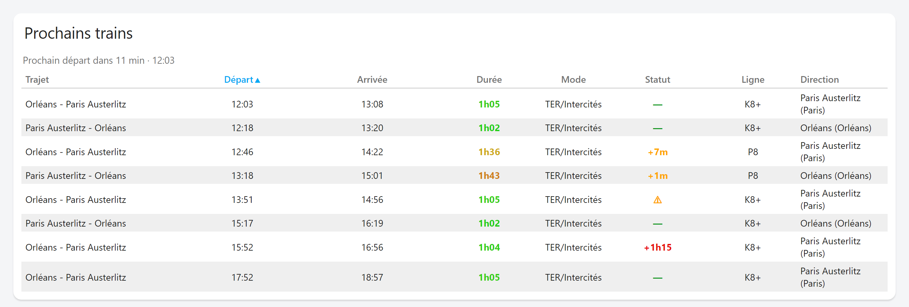
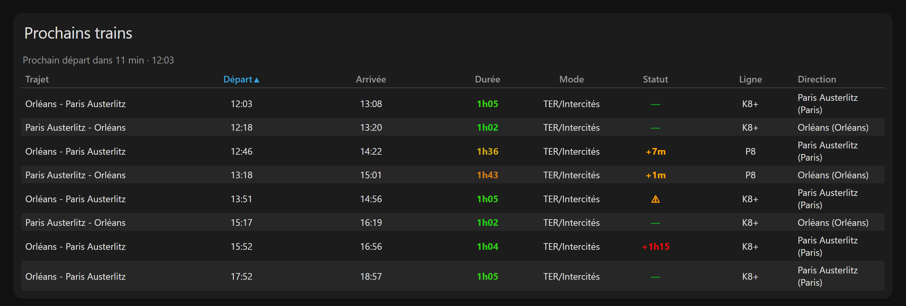

# Train Traveler Card

Tableau des prochains trains pour Home Assistant, à partir de l'intégration
[Train Traveler](https://github.com/Matthyeux/train-traveler) : une ligne par train,
une colonne par information.



- Lit les entités par leur **attribut `journeys`**, pas par leur `entity_id` : renommer une
  entité ne casse rien, et aucun sensor template n'est nécessaire.
- **Plusieurs trajets dans un seul tableau**, aller et retour côte à côte si tu veux.
- **Choix et ordre** des trajets et des colonnes, en YAML comme à la souris.
- **Tri** configurable et **clic sur les en-têtes** pour trier à la volée.
- **Durée en dégradé** vert → rouge, **retards** en vert / orange / rouge, seuils réglables.
- Les trains déjà partis **quittent le tableau tout seuls**, et un compte à rebours annonce
  le prochain départ.
- Éditeur graphique en six sections repliables.
- Sélecteur de carte **« par entité »** de HA 2026.6+ : cliquer sur un sensor de
  l'intégration propose deux mises en page prêtes à l'emploi.
- **Français et anglais**, carte et éditeur, suivant la langue de Home Assistant.

Version de la carte : **1.0.0** · Home Assistant **2024.4+** (le sélecteur par entité
demande 2026.6+, il est simplement ignoré avant).

## Installation

**Prérequis** — l'intégration [Train Traveler](https://github.com/Matthyeux/train-traveler)
de Matthyeux, qui fournit les données. Elle interroge l'API
[SNCF / Navitia](https://numerique.sncf.com/startup/api/) et crée, pour chaque liaison
configurée, un sensor `…_journeys` portant la liste des prochains trains. La carte ne fait
que lire ces entités : sans l'intégration, elle n'a rien à afficher.

**HACS** — dépôt personnalisé, catégorie *Lovelace*. HACS pose `carte-train.js` dans
`config/www/community/carte-train/` et déclare la ressource tout seul.

**Manuellement** — télécharger `carte-train.js` depuis la
[dernière release](https://github.com/Pulpyyyy/carte-train/releases/latest), le déposer dans
`config/www/community/carte-train/`, puis *Paramètres → Tableaux de bord → Ressources* :

```yaml
url: /local/community/carte-train/carte-train.js
type: module
```

La carte tient dans ce seul fichier : ni dépendance, ni fichier annexe à côté d'elle.
Après une installation par HACS, la ressource déjà déclarée pointe sur
`/hacsfiles/carte-train/carte-train.js` — c'est le même fichier, il n'y a rien à ajouter.

## Le minimum qui marche

Aucune option n'est obligatoire : sans configuration, la carte affiche tous les trajets
connus, triés par heure de départ, avec les colonnes par défaut.

```yaml
type: custom:train-traveler-card
```

## Configuration complète, commentée

```yaml
type: custom:train-traveler-card

# ---- En-tête ---------------------------------------------------------------
title: Orléans → Paris        # omis ou vide : pas d'en-tête du tout
show_title: true              # false : garde le texte en config, masque l'en-tête
show_countdown: true          # ligne « Prochain départ dans 12 min · 11:34 »

# ---- Quels trajets ---------------------------------------------------------
# Liste vide ou absente = tous les sensors `journeys` remontés par l'intégration,
# y compris ceux qu'elle ajoutera plus tard. Dès qu'une liste est écrite, elle
# est figée : un nouveau trajet n'apparaîtra pas tout seul.
# L'ordre compte uniquement avec `sort: manual`.
entities:
  - sensor.train_traveler_orl_par_journeys
  - sensor.train_traveler_par_orl_journeys

# ---- Quel ordre ------------------------------------------------------------
sort: departure               # departure | arrival | duration | status | line
                              # | physical_mode | direction | route | manual
sort_desc: false              # true : ordre décroissant
sortable: true                # false : en-têtes non cliquables

# ---- Quelles colonnes, dans quel ordre -------------------------------------
# Forme courte (un identifiant) ou forme longue (voir « Colonnes » plus bas).
columns:
  - departure
  - arrival
  - duration
  - physical_mode
  - status
  - line

# ---- Combien de trains, lesquels -------------------------------------------
max_journeys: 0               # 0 = tous ; la coupe est faite après le tri
hide_past: true               # false : garde les trains partis, en grisé

# ---- Format ----------------------------------------------------------------
time_format: auto             # auto | time | datetime
compact_mode: true            # « TER / Intercités » → « TER/Intercités »
more_info: true               # clic sur une ligne = fiche du sensor du trajet
background: rgba(25,25,25,0.6)   # fond de la ha-card ; omis = fond du thème

# ---- Couleurs et seuils ----------------------------------------------------
duration_colors: true         # dégradé vert → rouge sur la durée
duration_green: 60            # minutes : en dessous, plein vert
duration_red: 120             # minutes : au-dessus, plein rouge
delay_warn: 60                # secondes : retard affiché en orange à partir d'ici
delay_alert: 3600             # secondes : retard affiché en rouge à partir d'ici
color_ok: "#139523"
color_warn: "#ffa500"
color_alert: "#e70b0b"

# ---- Surcharges de libellés ------------------------------------------------
# Clef = entity_id. Une valeur vide ou absente laisse le nom de l'entité.
route_names:
  sensor.train_traveler_orl_par_journeys: Boulot
  sensor.train_traveler_par_orl_journeys: Retour
```

## Options

| Option | Type | Défaut | Description |
|---|---|---|---|
| `title` | string | — | En-tête de la carte. Omis ou vide : pas d'en-tête. |
| `show_title` | bool | `true` | `false` masque l'en-tête sans effacer `title`. |
| `show_countdown` | bool | `true` | Ligne « Prochain départ dans… » au-dessus du tableau. |
| `entities` | liste | `[]` | `entity_id` des sensors `journeys`. **Vide = tous**, y compris les futurs. |
| `entity` | string | — | Forme au singulier, équivalente à `entities: [ … ]`. |
| `route_names` | map | `{}` | `entity_id: nom` — surcharge le nom du trajet. |
| `columns` | liste | `[departure, arrival, duration, physical_mode, status, line]` | Colonnes et leur ordre. Liste vide = la valeur par défaut. |
| `sort` | string | `departure` | Colonne de tri au chargement (voir *Tri*). |
| `sort_desc` | bool | `false` | Inverse le sens du tri. |
| `sortable` | bool | `true` | En-têtes cliquables pour trier à la volée. |
| `max_journeys` | number | `0` | Nombre maximum de lignes, entier de 0 à 100. `0` = toutes. |
| `hide_past` | bool | `true` | Retire les trains dont l'heure de départ est passée. |
| `time_format` | string | `auto` | `auto`, `time` ou `datetime` (voir *Horaires*). |
| `compact_mode` | bool | `true` | Resserre le mode de transport autour de la barre. |
| `more_info` | bool | `true` | Clic sur une ligne → fiche du sensor du trajet. |
| `duration_colors` | bool | `true` | Dégradé de couleur sur la durée. |
| `duration_green` | number | `60` | Minutes en dessous desquelles la durée est plein vert. |
| `duration_red` | number | `120` | Minutes au-dessus desquelles la durée est plein rouge. |
| `delay_warn` | number | `60` | Secondes de retard à partir desquelles le statut passe en orange. |
| `delay_alert` | number | `3600` | Secondes de retard à partir desquelles il passe en rouge. |
| `color_ok` | string | `#139523` | Couleur du statut « à l'heure ». |
| `color_warn` | string | `#ffa500` | Couleur d'un retard modéré ou d'une perturbation. |
| `color_alert` | string | `#e70b0b` | Couleur d'un retard important. |
| `background` | string | — | Fond de la `ha-card`, n'importe quelle valeur CSS. |

Une configuration invalide (`columns` qui n'est pas une liste, `max_journeys` négatif,
`duration_green` au-dessus de `duration_red`…) affiche une carte d'erreur explicite plutôt
que d'échouer silencieusement.

## Colonnes

| Clef | En-tête | Contenu |
|---|---|---|
| `route` | Trajet | Nom du sensor, surchargeable par `route_names`. |
| `departure` | Départ | Heure de départ, mise en forme par `time_format`. |
| `arrival` | Arrivée | Heure d'arrivée. |
| `duration` | Durée | `1h05`, `35 min` — colorée si `duration_colors`. |
| `physical_mode` | Mode | Attribut `physical_mode`, resserré si `compact_mode`. |
| `status` | Statut | Retard, perturbation ou tiret vert (voir *Statut*). |
| `line` | Ligne | Attribut `line`. |
| `direction` | Direction | Terminus du train. |
| `from` | De | Gare de départ. |
| `to` | Vers | Gare d'arrivée. |
| `disruption` | Perturbation | Message de perturbation en clair, `-` s'il n'y en a pas. |

Une donnée absente affiche `-`. Forme longue, pour renommer, aligner, dimensionner ou figer
une colonne :

```yaml
columns:
  - departure                  # forme courte
  - key: arrival               # forme longue
    name: À Paris              # remplace l'en-tête
    width: 18%                 # n'importe quelle largeur CSS
  - key: duration
    align: right               # left | center | right
  - key: line
    sortable: false            # cette colonne ne réagit pas au clic
```

Valeurs par défaut : `align` vaut `left` pour `route`, `direction`, `from`, `to` et
`disruption`, `center` partout ailleurs ; `width` est fixée pour `route` (18 %),
`departure` et `arrival` (15 %), `duration` et `status` (12 %) et `line` (10 %).
`column` est accepté comme synonyme de `key`.

## Horaires

`time_format` décide de l'affichage de la date à côté de l'heure :

| Valeur | Départ | Arrivée |
|---|---|---|
| `auto` *(défaut)* | date affichée seulement si le train ne part pas aujourd'hui | date affichée seulement si l'arrivée tombe un autre jour que le départ |
| `time` | heure seule | heure seule |
| `datetime` | date et heure | date et heure |

Le mode `auto` est celui qui se lit le mieux : le train de 11h34 s'écrit `11:34`, celui de
demain matin `2 août 09:32`, et un train de nuit ne répète pas la date de son départ dans
sa colonne d'arrivée.

## Trains passés et compte à rebours

L'intégration ne se rafraîchit que toutes les douze minutes par défaut, mais l'heure, elle,
avance en continu. La carte se réveille donc **toutes les 30 secondes** tant qu'elle est à
l'écran : le compte à rebours descend, et un train dont l'heure de départ vient de passer
quitte le tableau tout seul si `hide_past` est vrai. Avec `hide_past: false`, il reste et
s'affiche en grisé.

`show_countdown` ajoute au-dessus du tableau une ligne « **Prochain départ dans 12 min ·
11:34** ». Elle parle du **prochain train à venir**, quels que soient le tri affiché et
`max_journeys` : masquer un train ne le retarde pas. Quand il n'y a plus rien à venir, elle
affiche « Aucun départ à venir ».

## Tri

`sort` fixe le tri au chargement :

- `departure`, `arrival`, `duration`, `status`, `line`, `physical_mode`, `direction`,
  `route` ;
- `manual` : l'ordre est celui de la liste `entities`, telle qu'écrite dans la
  configuration ; à l'intérieur d'un trajet, les trains restent classés par heure de
  départ.

Les valeurs manquantes sont **toujours** renvoyées en fin de tableau, quel que soit le sens
du tri. À égalité, l'heure de départ départage. `max_journeys` coupe **après** le tri : les
trois plus rapides et les trois prochains ne sont pas les mêmes trains, et c'est le tri qui
dit lequel des deux tu demandes.

Avec `sortable: true`, un clic sur un en-tête trie sur cette colonne, un second clic inverse
le sens (▲ / ▼ apparaît sur la colonne active). Ce tri est **temporaire** : il n'est pas
écrit dans la configuration et repart de `sort` au rechargement de la page.

### Revenir au tri configuré

Le tri de la configuration n'a pas toujours d'en-tête à cliquer : `manual` n'en a aucun par
construction, et rien n'oblige à afficher la colonne sur laquelle `sort` porte. Deux chemins
de retour, qui font exactement la même chose :

**Le bouton ↺**, au-dessus du tableau. Il n'apparaît **que** lorsqu'un tri au clic est actif,
et affiche la destination : `↺ ≡ Ordre personnalisé`, `↺ Départ ▲`… C'est le chemin fiable,
il ne dépend d'aucune colonne affichée.

**Le troisième clic** sur l'en-tête courant, sur n'importe quelle colonne :

| Clic | Résultat |
|---|---|
| 1 | Croissant sur cette colonne |
| 2 | Décroissant |
| 3 | Retour au tri configuré, `sort_desc` compris |

Quand le tri configuré est déjà l'état descendant de la colonne cliquée, il n'y a rien à
distinguer et le cycle reste à deux états. Le marqueur ≡ apparaît sur la colonne `route`
quand le tableau suit ton ordre personnalisé et que cette colonne est affichée.

## Durée

`duration_colors` colore la durée du trajet, du vert au rouge, en teinte HSL :

| Durée | Couleur |
|---|---|
| ≤ `duration_green` (60 min) | plein vert |
| entre les deux seuils | dégradé continu vert → orange → rouge |
| ≥ `duration_red` (120 min) | plein rouge |

La saturation et la luminosité restent fixes : toutes les durées se lisent avec le même
contraste, sur thème clair comme sur thème sombre. `duration_green` doit rester inférieur à
`duration_red` — sinon la carte refuse la configuration plutôt que de peindre au hasard.
`duration_colors: false` désactive complètement la coloration ; les seuils croisés sont
alors tolérés puisqu'ils ne servent plus.

## Statut

La colonne `status` lit l'attribut `delay` du trajet, en secondes, et sa liste
`disruptions` :

| Situation | Affichage | Couleur |
|---|---|---|
| Retard ≥ `delay_alert` (1 h) | `+1h15` | `color_alert` |
| Retard ≥ `delay_warn` (1 min) | `+7m` | `color_warn` |
| Perturbation sans retard chiffré | `⚠`, message en infobulle | `color_warn` |
| Rien à signaler | `—` | `color_ok` |

Une perturbation sans retard — grève, service réduit, travaux — n'est pas « à l'heure » pour
autant : elle sort en orange plutôt que de disparaître. Le message complet est disponible en
infobulle, et la colonne `disruption` l'affiche en clair si tu préfères le voir en
permanence.

## Éditeur graphique

Six sections repliables, dans l'ordre des décisions :

| Section | Contenu |
|---|---|
| **Trajets** | Une case par sensor `journeys` détecté, ▲ / ▼ pour ordonner. |
| **Tri** | `sort`, `sort_desc`, `sortable`. « ≡ Ordre personnalisé des trajets » est en tête de liste, séparé des tris portant sur une donnée. |
| **Colonnes** | Interrupteur par colonne, ▲ / ▼ pour ordonner. |
| **Affichage** | `title`, `show_title`, `show_countdown`, `max_journeys`, `hide_past`, `time_format`, `compact_mode`, `more_info`. |
| **Couleurs et seuils** | `duration_colors`, les deux seuils de durée, les deux seuils de retard et les trois couleurs. |
| **Noms des trajets** | Un champ par trajet affiché, plus les surcharges devenues orphelines. |

`background` n'est pas exposé par l'éditeur : il se règle en YAML et l'éditeur le conserve
intact.

Seule *Trajets* est ouverte au départ ; chaque section repliée affiche son état
(« 2 sur 3 », « Heure de départ ↑ », « vert < 60 min · rouge > 120 min »…), inutile de
l'ouvrir pour savoir ce qu'elle contient. Dans les listes à interrupteurs, les éléments
affichés sont regroupés en tête, un séparateur *Masqués* marque la frontière.

Deux verrous, avec leur explication en infobulle : la dernière colonne et le dernier trajet
cochés ne peuvent pas être décochés — une liste vide signifiant « tous » ou « ceux par
défaut », l'éditeur ferait exactement l'inverse de ce qui est demandé.

**Liste figée à la première modification.** Tant que la section *Trajets* n'est pas touchée,
`entities` reste absent de la configuration et la carte suit tous les trajets de
l'intégration, futurs compris — toutes les cases sont donc cochées. Dès que tu en décoches
un, que tu en réordonnes un, ou que tu choisis « ≡ Ordre personnalisé », la liste complète
est écrite en configuration et cesse de suivre les ajouts de l'intégration. Pour revenir au
suivi automatique, il faut retirer `entities` à la main en YAML.

## Sélecteur de carte « par entité » (HA 2026.6+)

Dans l'onglet *Par entité* du sélecteur de cartes, choisir un sensor `journeys` de
l'intégration fait apparaître deux propositions, section *Communauté* :

- **Prochains trains — *trajet*** : le tableau complet pour ce trajet ;
- **Prochains trains, vue compacte** : quatre colonnes, quatre trains, pour une place
  restreinte.

## Langue

La carte et l'éditeur sont traduits en **français** et en **anglais**. La langue suit celle
du frontend (`hass.locale.language`) : français dès qu'elle commence par `fr` — `fr`,
`fr-CA`, `fr-BE` —, anglais dans tous les autres cas. Il n'y a aucune option à régler, et
changer de langue dans Home Assistant met la carte à jour sans recharger la page.

Une table par langue en tête de [`dist/carte-train.js`](dist/carte-train.js) — la carte est
un fichier unique, comme tout plugin HACS. **Ajouter une langue** tient en trois gestes :
copier la table `FR` sous un autre nom et traduire les valeurs — les clefs sont communes et
rangées dans le même ordre —, l'ajouter à `STRINGS`, puis étendre `setLanguageFrom`. Les
contributions sont les bienvenues.

Ce qui **n'est pas** traduit, volontairement :

- les identifiants de configuration (`sort`, `columns`, `entities`…), qui sont des clefs
  YAML et non du texte affiché ;
- les données remontées par l'intégration : noms de gares, lignes, directions, modes de
  transport et messages de perturbation viennent de l'API SNCF et sont affichés tels quels.

Le nom et la description affichés dans le sélecteur de cartes sont lus une seule fois au
chargement du fichier : eux seuls demandent un rechargement de la page après un changement
de langue.

## Variables CSS

À définir sur la carte (via `card_mod` ou un thème) :

| Variable | Défaut | Effet |
|---|---|---|
| `--train-traveler-font-size` | `14px` | Taille du texte du tableau. |
| `--train-traveler-stripe` | `rgba(127,127,127,0.12)` | Fond des lignes paires. |
| `--train-traveler-hover` | `rgba(127,127,127,0.22)` | Fond de la ligne survolée. |

Les couleurs de durée et de retard ne passent pas par des variables : elles sont calculées
par ligne à partir des seuils et des trois options `color_*`.

Sous 600 px de large, la carte réduit d'elle-même le texte et les marges. En vue *sections*,
elle demande la pleine largeur (minimum 6 colonnes sur 12).

La carte suit le thème de Home Assistant :



*Les deux captures montrent huit colonnes sur les onze reconnues, sur un relevé réel de la
liaison Orléans – Paris Austerlitz. Elles sont produites par
[`tools/screenshot.html`](tools/screenshot.html), qui charge la vraie carte depuis `dist/`
et lui passe un `hass` réduit ; `pwsh tools/screenshot.ps1` les régénère. Les horaires y
sont calculés depuis l'heure courante, la capture montre donc toujours des trains à venir.*

## Dépannage

**« Aucun trajet : vérifie l'intégration Train Traveler. »** — aucun sensor ne porte un
attribut `journeys` qui soit une liste de trajets. Vérifier que l'intégration est chargée,
que ses entités ne sont pas désactivées, et que le sensor cherché est bien celui qui se
termine par `_journeys` : les sensors `_next_journey_1`, `_departure_*` et `_arrival_*`
portent un seul train et ne sont pas lus par la carte.

**« Aucun des trajets demandés n'est remonté par l'intégration. »** — les `entity_id` de
`entities` ne correspondent à rien de connu. Les comparer avec ce qu'affiche *Outils de
développement → États* en filtrant sur `journeys`.

**« Plus aucun départ à venir. »** — tous les trains connus de l'intégration sont partis.
C'est le cas normal en fin de journée ; `hide_past: false` les laisse affichés, en grisé.

**La colonne Statut est toujours au tiret vert** — l'attribut `delay` ne sort de `null` que
lorsque l'API signale une perturbation de type `SIGNIFICANT_DELAYS` sur la gare de départ.
Pas de retard annoncé, pas de retard affiché.

**Le compte à rebours ne bouge plus** — il ne se met à jour que tant que la carte est à
l'écran : le minuteur est arrêté dès qu'elle en sort, et repart à son retour.
